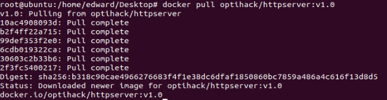

### 第三周作业
#### 1. 编写httpserver.go
```
package main

import (
	"fmt"
	"io"
	"log"
	"net/http"
	"os"
	"time"

	_ "net/http/pprof"
)

// 访问日志表
var visitLogMap = make(map[int16]visitLog)

type visitLog struct {
	id       int16
	time     string
	url      string
	clientIp string
	code     string
}

var id int16 = 0

func main() {
	// 设置启动参数v
	// flag.Set("v", "4")
	// glog.V(2).Info("Starting http server...")

	// 设置系统环境变量VERSION
	os.Setenv("VERSION", "666")
	// http.HandleFunc("/", rootHandler)
	// c, python, java := true, false, "no!"
	// fmt.Println(c, python, java)
	// err := http.ListenAndServe(":80", nil)
	mux := http.NewServeMux()
	mux.HandleFunc("/", rootHandler)
	mux.HandleFunc("/healthz", healthzHandler)
	// mux.HandleFunc("/debug/pprof/", pprof.Index)
	// mux.HandleFunc("/debug/pprof/profile", pprof.Profile)
	// mux.HandleFunc("/debug/pprof/symbol", pprof.Symbol)
	// mux.HandleFunc("/debug/pprof/trace", pprof.Trace)
	err := http.ListenAndServe(":80", mux)
	if err != nil {
		log.Fatal(err)
	}
}

func healthzHandler(w http.ResponseWriter, r *http.Request) {
	// fmt.Println("entering healthz handler")
	// 返回200
	w.WriteHeader(200)
	w.Header().Set("statusCode", "200")
	io.WriteString(w, "200\n")

	// 记录访问日志
	record(w, r)
}

func rootHandler(w http.ResponseWriter, r *http.Request) {
	// fmt.Println("entering root handler")
	user := r.URL.Query().Get("user")
	if user != "" {
		io.WriteString(w, fmt.Sprintf("hello [%s]\n", user))
	} else {
		io.WriteString(w, "hello [stranger]\n")
	}
	io.WriteString(w, "===================Details of the http request header:============\n")
	for k, v := range r.Header {
		// 将request header写入response header
		w.Header().Add(k, v[0])
		io.WriteString(w, fmt.Sprintf("%s=%s\n", k, v))
		// fmt.Printf("response header %s: %s\n", k, w.Header().Get(k))
	}

	// 读取当前系统环境变量VERSION, 并写入 Response Header
	version := os.Getenv("VERSION")
	w.Header().Add("version", version)
	// fmt.Printf("response header version: %s", w.Header().Get("version"))
	io.WriteString(w, fmt.Sprintf("%s=%s\n", "version", w.Header().Get("version")))

	w.Header().Set("statusCode", "200")
	w.WriteHeader(200)

	// 记录访问日志
	record(w, r)
}

func record(w http.ResponseWriter, r *http.Request) {
	var record visitLog
	id += 1
	record.id = id
	record.clientIp = r.Host
	record.code = w.Header().Get("statusCode")
	record.url = r.RequestURI
	record.time = time.Now().Format("2006-01-02 15:04:05")
	visitLogMap[record.id] = record

	io.WriteString(w, "===================visit info===================\n")
	v := visitLogMap[id]
	io.WriteString(w, fmt.Sprintf("visit time: %s\n", v.time))
	io.WriteString(w, fmt.Sprintf("client ip: %s\n", v.clientIp))
	io.WriteString(w, fmt.Sprintf("status code: %s\n", v.code))
	io.WriteString(w, fmt.Sprintf("visit url: %s\n", v.url))
}
```

#### 2. 编写Dockerfile
```
FROM ubuntu
ENV MY_SERVICE_PORT=80

LABEL label="httpserver"
ADD httpserver /httpserver/

RUN apt-get update && apt-get install -y golang
RUN go env -w GO111MODULE=on
RUN go env -w GOSUMDB=off
RUN go env -w GOPROXY=https://goproxy.cn,direct

EXPOSE 80
ENTRYPOINT ["nohup", "go", "run", "/httpserver/httpserver.go", "&"]
```

#### 3. 构建本地镜像
docker build ./


#### 4. 镜像打tag
docker tag 2f95f4efa95f optihack/httpserver:v1.0


#### 5. 推送镜像
docker push optihack/httpserver:v1.0


### 6. 拉取镜像
docker pull optihack/httpserver:v1.0



### 7. 启动容器
docker run -p 80:80 --name httpserver -itd optihack/httpserver:v1.0


### 8. 调用healthz接口


### 9. 调用user接口


### 10. 使用nsenter进入容器查看IP配置
docker inspect cbbd4a2ca734 | grep -i pid
export pid=14726
nsenter -t 14726 -n ip a

