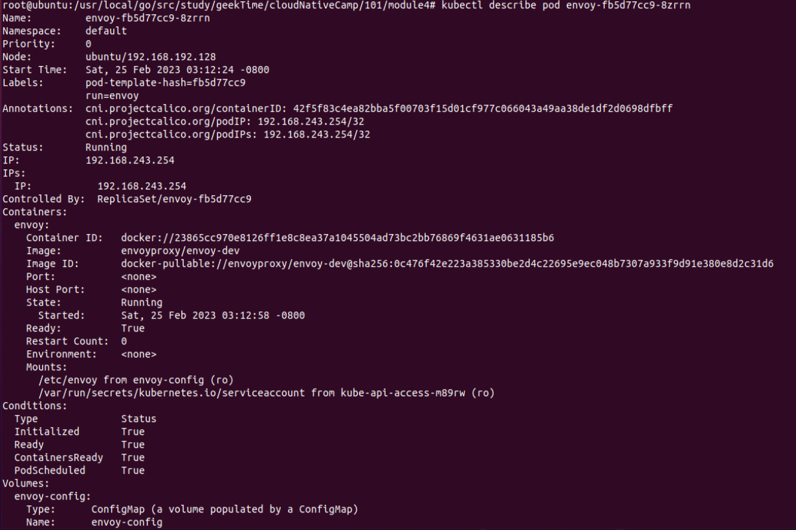

### 第四周作业
#### 1. 创建configMap, 挂载envoy.yaml
```
kubectl create configmap envoy-config --from-file=envoy.yaml
```

### 2. 创建envoy pod
```
kubectl apply -f envoy-deploy.yaml
```

### 3. 查看pod列表
```
kubectl get pod
```


### 4. 暴露端口
```
kubectl expose deploy envoy --selector run=envoy --port=10000 --type=NodePort
```

### 5. 进入pod, 查看进程信息
```
kubectl exec -it envoy-fb5d77cc9-8zrrn bash
```


### 6. 查看pod详情
```
kubectl describe pod envoy-fb5d77cc9-8zrrn
```


### 7. 访问接口
```
curl 192.168.243.254:10000
```


### 8. 更改配置的监听端口并测试访问入口的变化
未实现

### 9. 通过非级联删除的方法逐个删除对象
未实现