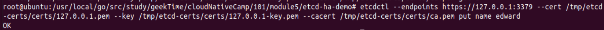

### 第五周作业
#### 1. 构建多节点etcd集群
##### 1.1 安装cfssl
```sh
apt install golang-cfssl
```

##### 1.2 下载etcd项目
```sh
mkdir /root/go/src/github.com/etcd-io
cd /root/go/src/github.com/etcd-io
git clone https://github.com/etcd-io/etcd.git
cd etcd/hack/tls-setup
```

##### 1.3 编辑req-scr配置文件
```sh
vi config/req-scr.json
```


##### 1.4 配置infra信息
```sh
export infra0=127.0.0.1
export infra1=127.0.0.1
export infra2=127.0.0.1
```


##### 1.5 编译
```sh
make
```


etcd 证书信息为


##### 1.6 将证书转移到/tmp/etcd-certs目录
```sh
mkdir /tmp/etcd-certs
mv certs /tmp/etcd-certs
```

##### 1.7 启动start-all.sh脚本
```sh
./start-all.sh
```
start-all.shs脚本为
```
nohup etcd --name infra0 \
--data-dir=/tmp/etcd/infra0 \
--listen-peer-urls https://127.0.0.1:3380 \
--initial-advertise-peer-urls https://127.0.0.1:3380 \
--listen-client-urls https://127.0.0.1:3379 \
--advertise-client-urls https://127.0.0.1:3379 \
--initial-cluster-token etcd-cluster-1 \
--initial-cluster infra0=https://127.0.0.1:3380,infra1=https://127.0.0.1:4380,infra2=https://127.0.0.1:5380 \
--initial-cluster-state new \
--client-cert-auth --trusted-ca-file=/tmp/etcd-certs/certs/ca.pem \
--cert-file=/tmp/etcd-certs/certs/127.0.0.1.pem \
--key-file=/tmp/etcd-certs/certs/127.0.0.1-key.pem \
--peer-client-cert-auth --peer-trusted-ca-file=/tmp/etcd-certs/certs/ca.pem \
--peer-cert-file=/tmp/etcd-certs/certs/127.0.0.1.pem \
--peer-key-file=/tmp/etcd-certs/certs/127.0.0.1-key.pem 2>&1 > /var/log/infra0.log &

nohup etcd --name infra1 \
--data-dir=/tmp/etcd/infra1 \
--listen-peer-urls https://127.0.0.1:4380 \
--initial-advertise-peer-urls https://127.0.0.1:4380 \
--listen-client-urls https://127.0.0.1:4379 \
--advertise-client-urls https://127.0.0.1:4379 \
--initial-cluster-token etcd-cluster-1 \
--initial-cluster infra0=https://127.0.0.1:3380,infra1=https://127.0.0.1:4380,infra2=https://127.0.0.1:5380 \
--initial-cluster-state new \
--client-cert-auth --trusted-ca-file=/tmp/etcd-certs/certs/ca.pem \
--cert-file=/tmp/etcd-certs/certs/127.0.0.1.pem \
--key-file=/tmp/etcd-certs/certs/127.0.0.1-key.pem \
--peer-client-cert-auth --peer-trusted-ca-file=/tmp/etcd-certs/certs/ca.pem \
--peer-cert-file=/tmp/etcd-certs/certs/127.0.0.1.pem \
--peer-key-file=/tmp/etcd-certs/certs/127.0.0.1-key.pem 2>&1 > /var/log/infra1.log &

nohup etcd --name infra2 \
--data-dir=/tmp/etcd/infra2 \
--listen-peer-urls https://127.0.0.1:5380 \
--initial-advertise-peer-urls https://127.0.0.1:5380 \
--listen-client-urls https://127.0.0.1:5379 \
--advertise-client-urls https://127.0.0.1:5379 \
--initial-cluster-token etcd-cluster-1 \
--initial-cluster infra0=https://127.0.0.1:3380,infra1=https://127.0.0.1:4380,infra2=https://127.0.0.1:5380 \
--initial-cluster-state new \
--client-cert-auth --trusted-ca-file=/tmp/etcd-certs/certs/ca.pem \
--cert-file=/tmp/etcd-certs/certs/127.0.0.1.pem \
--key-file=/tmp/etcd-certs/certs/127.0.0.1-key.pem \
--peer-client-cert-auth --peer-trusted-ca-file=/tmp/etcd-certs/certs/ca.pem \
--peer-cert-file=/tmp/etcd-certs/certs/127.0.0.1.pem \
--peer-key-file=/tmp/etcd-certs/certs/127.0.0.1-key.pem 2>&1 > /var/log/infra2.log &
```

##### 1.7 检查infra信息
```sh
ps -ef | grep infra
```


##### 1.8 检查etcd中的member信息

```sh
etcdctl --endpoints https://127.0.0.1:3379 --cert /tmp/etcd-certs/certs/127.0.0.1.pem --key /tmp/etcd-certs/certs/127.0.0.1-key.pem --cacert /tmp/etcd-certs/certs/ca.pem member list
```


##### 1.9 添加key
```
etcdctl --endpoints https://127.0.0.1:3379 --cert /tmp/etcd-certs/certs/127.0.0.1.pem --key /tmp/etcd-certs/certs/127.0.0.1-key.pem --cacert /tmp/etcd-certs/certs/ca.pem put name edward
```


##### 1.10 查看key
```
etcdctl --endpoints https://127.0.0.1:3379 --cert /tmp/etcd-certs/certs/127.0.0.1.pem --key /tmp/etcd-certs/certs/127.0.0.1-key.pem --cacert /tmp/etcd-certs/certs/ca.pem get name
```


##### 1.11 删除key
```
etcdctl --endpoints https://127.0.0.1:3379 --cert /tmp/etcd-certs/certs/127.0.0.1.pem --key /tmp/etcd-certs/certs/127.0.0.1-key.pem --cacert /tmp/etcd-certs/certs/ca.pem del name
```


#### 2. 创建高可用etcd集群
##### 2.1 下载并安装helm
```
https://github.com/helm/helm/releases
```

##### 2.2 添加bitnami到helm仓库中
```sh
helm repo add bitnami https://charts.bitnami.com/bitnami
```

##### 2.3 安装etcd并启动集群
```sh
helm install my-release bitnami/etcd
```


