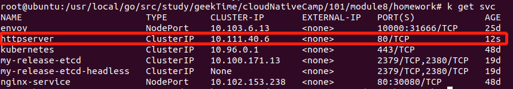

# 第八周作业

## 1. 第一部分
### 1.1 grace.yaml
```
apiVersion: v1
kind: Pod
metadata:
  name: grace
spec:
  containers:
    - name: grace
      image: optihack/httpserver:v1.0
      readinessProbe:
        httpGet:
          path: /healthz
          port: 80
        initialDelaySeconds: 30
        periodSeconds: 5
      lifecycle:
        preStop:
          exec:
            command: ["echo","grace stop..."]
      resources:
        limits:
          memory: "500Mi"
          cpu: "500m"
        requests:
          memory: "200Mi"
          cpu: "200m"
```

### 1.2 优雅启动, 延迟30秒并使用/healthz接口探活
pod刚启动时, running为0/1

30秒后, running为1/1


### 1.3 优雅终止, 添加hook, 终止前运行echo命令
```
lifecycle:
    preStop:
        exec:
            command: ["echo","grace stop..."]
```

### 1.4 资源需求和 QoS 保证
```
resources:
    limits:
        memory: "500Mi"
        cpu: "500m"
    requests:
        memory: "200Mi"
        cpu: "200m"
```
通过 kubectl get pod grace -oyaml 查看pod状态, 可以看到qosClass为Burstable


### 1.5 探活, 使用readinessProbe 延迟30秒后, 每5秒进行一次探活
```
readinessProbe:
    httpGet:
        path: /healthz
        port: 80
    initialDelaySeconds: 30
    periodSeconds: 5
```

### 1.6 日常运维需求，日志等级
待实现

### 1.7 配置和代码分离
待实现


## 2. 第二部分
### 2.1 service部署
##### 2.1.1 给pod打上标签
```
metadata:
  name: grace
  labels:
    app: httpserver
```


##### 2.1.2 定义service.yaml
指定selector为httpserver
```
apiVersion: v1
kind: Service
metadata:
  name: httpserver
spec:
  type: ClusterIP
  ports:
    - port: 80
      protocol: TCP
      name: http
  selector:
    app: httpserver
```

##### 2.1.3 启动service
```bash
kubectl apply -f service.yaml
```

##### 2.1.4 查看service
```bash
kubectl get svc
```


##### 2.1.5 查看service详情
```bash
kubectl get svc httpserver -oyaml
```


##### 2.1.6 调用curl访问服务, 成功访问
```bash
curl 10.111.40.6:80
```


#### 2.2 ingress部署
待实现