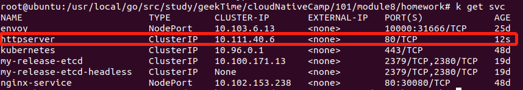

# 第九周作业
## 1 service部署
### 1.1 给pod打上标签
```
metadata:
  name: grace
  labels:
    app: httpserver
```


### 1.2 定义service.yaml
指定selector为httpserver
```
apiVersion: v1
kind: Service
metadata:
  name: httpserver
spec:
  type: ClusterIP
  ports:
    - port: 80
      protocol: TCP
      name: http
  selector:
    app: httpserver
```

### 1.3 启动service
```bash
kubectl apply -f service.yaml
```

### 1.4 查看service
```bash
kubectl get svc
```


### 1.5 查看service详情
```bash
kubectl get svc httpserver -oyaml
```


### 1.6 调用curl访问服务, 成功访问
```bash
curl 10.111.40.6:80
```


## 2 ingress部署
待实现